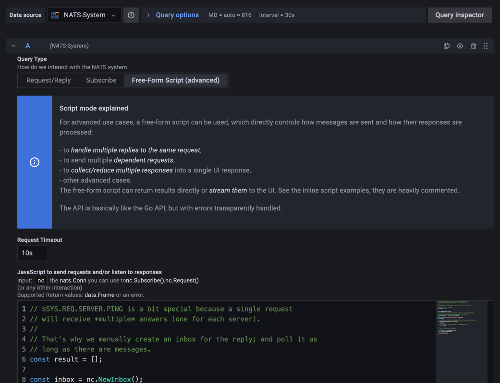
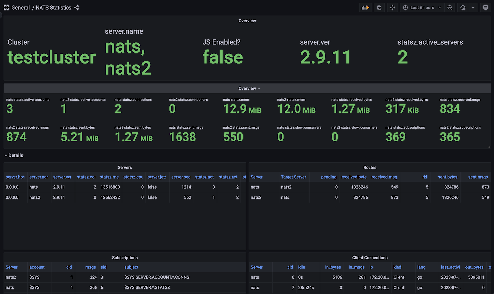

# NATS DataSource

NATS is an Open Source Message Bus on steroids, with many additional features over the core functionality.

If you use NATS as central system to connect different applications together, observability into the system is
crucial.

Features:

- **Request/Reply:** send a request on a certain topic, and visualize the response.
   - The response can be post-processed if needed via JavaScript.
   - This is useful if you want to *query* some connected system via NATS when the dashboard is opened.
- **Subscribe:** Listen to a certain topic, and visualize the messages as they stream into the system.
   - The messages can be post-processed if needed via JavaScript.
   - This is useful if you have a stream of continuous data (f.e. Logs) and you want to use them as they arrive.
- **Free-Form Script:** This is an advanced mode, which can send **multiple NATS requests**, wait for **multiple responses**
  and do **any kind of processing**. See below for examples.
- A default **Dashboard** which shows NATS system metrics via the `$SYS` account.

## Screenshots






## Request / Reply Mode explained

[NATS Request/Reply](https://docs.nats.io/nats-concepts/core-nats/reqreply) sends a request on the given subject with
an empty payload, and *renders the single response* (delivered to the _INBOX).

JSON messages can be rendered directly - nested JSON is flattened. Example messages:

```
{"key1": "val1", "key2": "value2"}

[{"key1": "val1", "key2": "value2"}, {"key1": "val3"}]
```


You can post-process each message via JavaScript, for example:

**Simple script**

```js
// This script is by default used in the backend if no script is given.

// msg.Data contains the received NATS message as string.
// by default, the last line of a script is returned automatically.
JSON.parse(msg.Data)
```

**Accessing Headers**

```js
// You can covert NATS message headers to columns (and in the same way, do any kind of calculation)

row = JSON.parse(msg.Data)
row["otherHeader"] = msg.Header.Get("My-Header")    

return row
```


### Scripting API

Input: `msg` contains the received message as a [nats.Msg](https://pkg.go.dev/github.com/nats-io/nats.go#Msg).

Supported Return values: A map `{k: "v"}`, a list of maps `[{k: "v"}]`,
a [data.Frame](https://pkg.go.dev/github.com/grafana/grafana-plugin-sdk-go@v0.147.0/data#Frame).


## Subscribe Mode explained

[NATS Subscribe](https://docs.nats.io/nats-concepts/core-nats/pubsub) listens to messages on the given subject pattern,
and sends them via [Grafana Live](https://grafana.com/docs/grafana/latest/setup-grafana/set-up-grafana-live/) to the
frontend.

JSON messages can be rendered directly - nested JSON is flattened. Example messages:

```
{"key1": "val1", "key2": "value2"}
```

You can post-process each message via JavaScript, for example:

**Simple script**

```js
// This script is by default used in the backend if no script is given.

// msg.Data contains the received NATS message as string.
// by default, the last line of a script is returned automatically.
JSON.parse(msg.Data)
```

**Accessing Headers**

```js
// You can covert NATS message headers to columns (and in the same way, do any kind of calculation)

row = JSON.parse(msg.Data)
row["otherHeader"] = msg.Header.Get("My-Header")    

return row
```

### Scripting API

Input: `msg` contains the received message as a [nats.Msg](https://pkg.go.dev/github.com/nats-io/nats.go#Msg).

Supported Return values: A map `{k: "v"}` (because the results are *streamed* to the UI).


## Free-Form Script (advanced) explained

For advanced use cases, a free-form script can be used, which directly controls how messages
are sent and how their responses are processed:

- to *handle multiple replies to the same request*
- to send multiple *dependent requests*
- to *collect/reduce multiple responses* into a single UI response,
- other advanced cases.

The free-form script can return results directly or *stream them* to the UI. See the inline
script examples, they are heavily commented.

The API is basically like the Go API, but with errors transparently handled.

**Multiple Requests**

```js
// do two requests on different NATS subjects (json1 and json2)
const msg1 = nc.Request("json1", "", "50ms");
const msg2 = nc.Request("json2", "", "50ms");

// parse the response data as JSON
const parsed1 = JSON.parse(msg1.Data);
const parsed2 = JSON.parse(msg2.Data);

// return the concatenated list
return [parsed1, parsed2];
```

**Multiple Responses**

```js
// Sometimes, you receive *multiple responses* for a single request, f.e. when
// triggering $SYS.REQ.SERVER.PING in the SYS account, you will receive one answer
// per server.
//
// That's why we manually create an inbox for the reply; and poll it as
// long as there are messages.
const result = [];

const inbox = nc.NewInbox();
// The ordering is crucial: we first need to create the subscription, before
// sending the request (otherwise we might miss the response).
const subscription = nc.SubscribeSync(inbox);
nc.PublishRequest("$SYS.REQ.SERVER.PING", inbox, "");
while(true) {
  // we poll until we do not receive a message anymore within the given timeout.
  const msg = subscription.NextMsg("50ms");
  if (!msg) {
    // ... when this happens, we return the accumulated result.
    return result;
  }
  // here, we parse the given message.
  const parsed = JSON.parse(msg.Data);
  delete parsed.statsz.routes;
  result.push(parsed);
}
```

### Scripting API

Input: `nc` the [nats.Conn](https://pkg.go.dev/github.com/nats-io/nats.go#Conn) you can use to:

- [nc.Subscribe()](https://pkg.go.dev/github.com/nats-io/nats.go#Conn.Subscribe) for subscribing to a topic;
- [nc.Request()](https://pkg.go.dev/github.com/nats-io/nats.go#Conn.Request) for sending out a request, and listening
  to a response
- any other interaction with the Go API.

Supported Return values: A map `{k: "v"}`, a list of maps `[{k: "v"}]`,
a [data.Frame](https://pkg.go.dev/github.com/grafana/grafana-plugin-sdk-go@v0.147.0/data#Frame).

## Developing

```
./dev.sh setup
./dev.sh build-backend
./dev.sh watch-frontend
./dev.sh up
# http://127.0.0.1:3000/plugins?filterBy=all&q=nats

# to hot-reload the plugin:
./dev.sh reload-plugin

./dev.sh test-nats-server 
```

